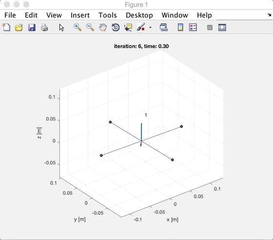

TODO: update this
## Quadrotor Control, Path Planning and Trajectory Optimization
This repo include matlab solution for upenn advanced robotics course:

- Motion and control
- Path planning and Trajectories optimization
- Computer vision and it's relatives

## PD based 3D Controller
#### Trajectories: Helix and Line:

 

##### Velocities and Position for Helix:

  
